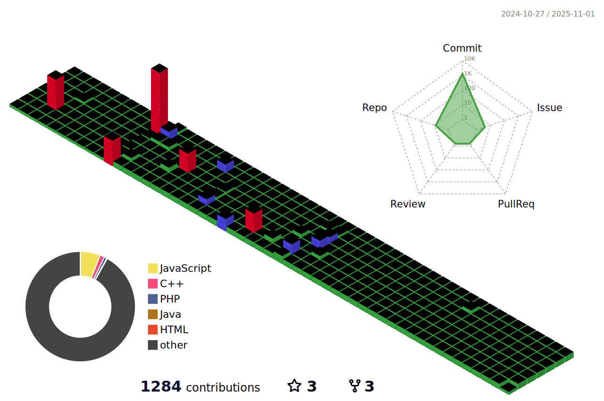

## Hi 👋

- 📕새로운 기술을 배우는 걸 좋아하는 개발자입니다.
- 🗨️소통과 협력을 중요하게 생각하는 개발자입니다.

  <h2>My Tech ⛸</h2>
  
  
  
  
   
  
  
  
  
   
   
    
     
    
   
  
  
  
  
   
  
  
  
  
   
  
	
  

## Plants 🌱

## Update Time 🕗

Wed Jan 15 23:19:03 UTC 2025
